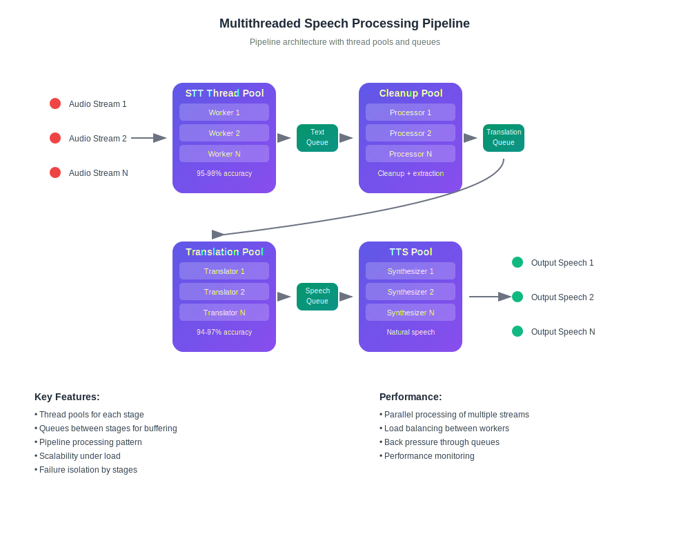

<HomeHeroSection />

> [!tip] Who is this for?  
> Built for **international teams** where language barriers cause **delays**, **lost deals**, or **costly misunderstandings**. [Learn more ...](./product/overview/markets)

## Clear and Simple Pricing

From first call to fluent conversations — at any scale.

<PricingPlansSection />

> [!warning] 😱 Either you speak every language — or someone else closes your deals.

## What Customers Are Saying

<AutoScrollTestimonials testimonialsUrl="/testimonials.json"/>

> [!tip] 🥇 Your time is better spent mastering your craft — not memorizing grammar.

## Frequently Asked Questions

<!-- <<< ./interpretating.svg -->

<FAQSection />
<HomeFooterSection />
