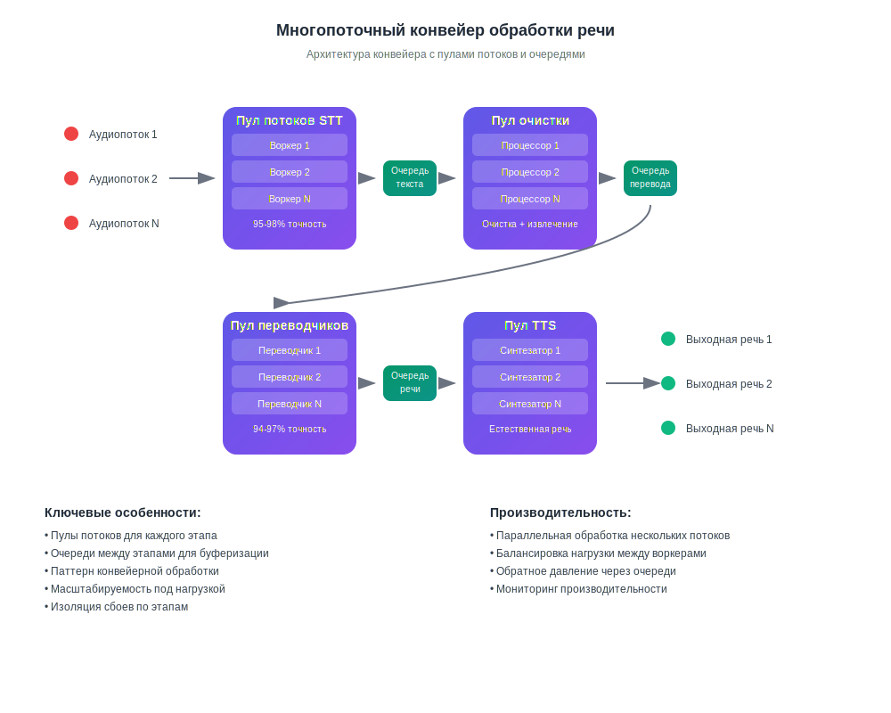

<HomeHeroSection />

> [!tip] Для кого это предназначено?  
> Создано для **международных команд**, где языковые барьеры вызывают **задержки**, **потерянные сделки** или **дорогостоящие недоразумения**. [Узнать больше ...](./product/overview/markets)

## Прозрачные и простые цены

От первого звонка до свободного общения — в любом масштабе.

<PricingPlansSection />

> [!warning] 😱 Либо вы говорите на всех языках — либо кто-то другой заключает ваши сделки.

## Что говорят клиенты

<AutoScrollTestimonials testimonialsUrl="/testimonials.json"/>

> [!tip] 🥇 Ваше время лучше потратить на совершенствование мастерства — а не на заучивание грамматики.

## Часто задаваемые вопросы

<!-- <<< ./interpretating.svg -->

<FAQSection />
<HomeFooterSection />