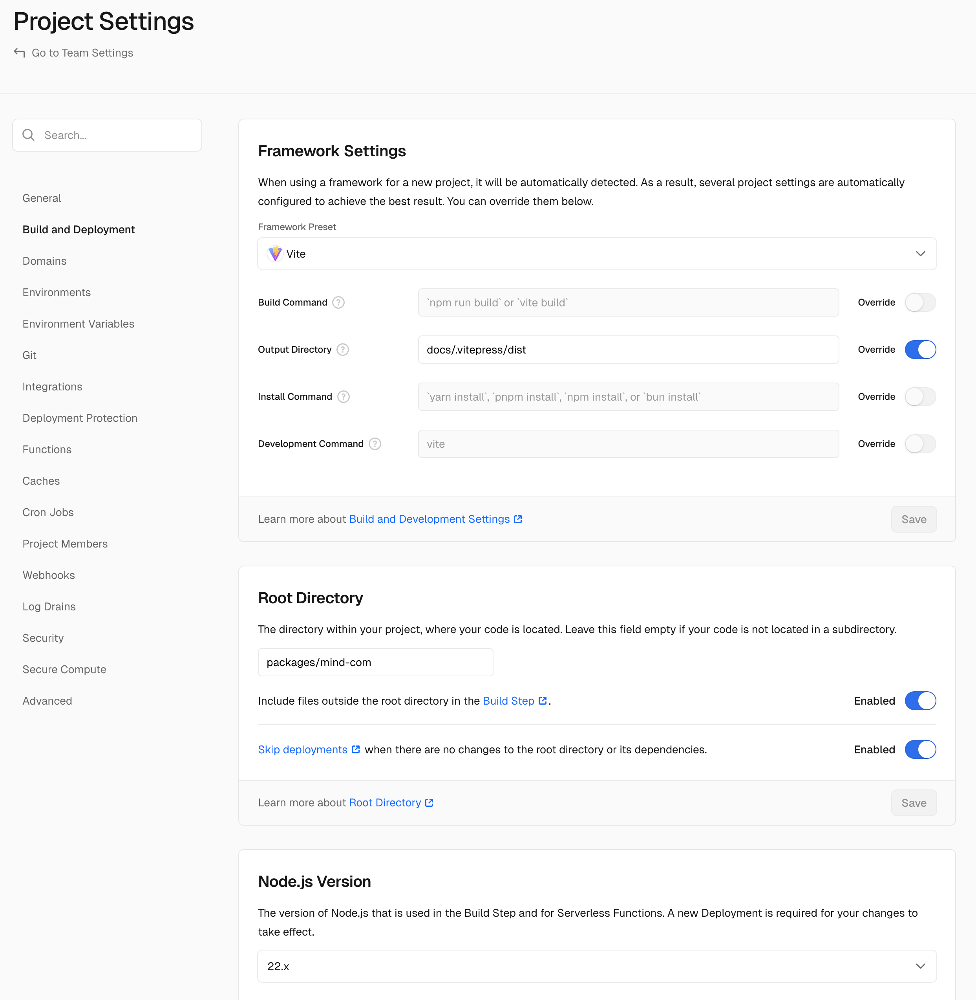
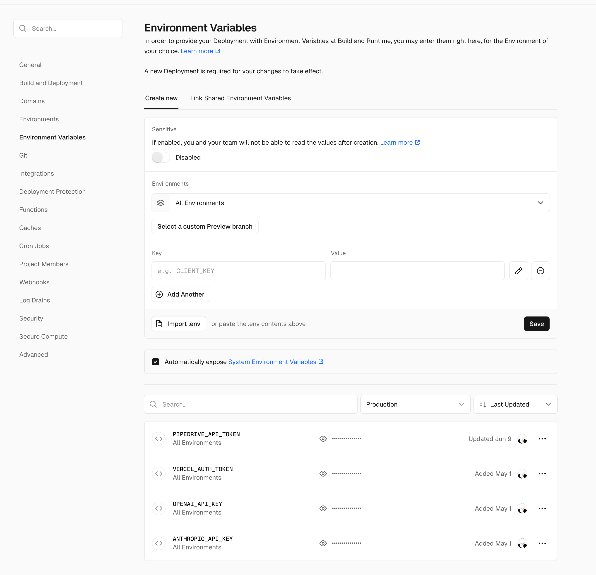

# Mind.com

Platform for real-time speech translation in video calls. Eliminates language barriers for international teams.

## Project Description

Mind.com is a VitePress website with multilingual support, integrated with Pipedrive CRM and OAuth authorization. The project includes:

- 📄 VitePress documentation with support for 12+ languages
- 🔗 API endpoints for CRM integration
- 🚀 OAuth authorization through external service
- 📝 Contact forms with lead submission to Pipedrive
- 📊 Google Analytics integration via GTM

## Project Structure

```
packages/mind-com/
├── docs/                           # VitePress documentation
│   ├── .vitepress/
│   │   ├── config/                 # VitePress configuration
│   │   │   ├── i18n/              # Localization configurations
│   │   │   ├── en.ts              # English localization
│   │   │   └── shared.ts          # Shared settings
│   │   └── theme/                 # Custom theme
│   │       ├── components/        # Vue components
│   │       ├── composables/       # Vue composables
│   │       └── styles/           # CSS styles
│   ├── en/                        # English content
│   └── i18n/                      # Translations to other languages
├── api/                           # Vercel API endpoints
│   ├── mind-com/
│   │   └── createContactAndLead.ts # CRM integration
│   └── lib/                       # API utilities
├── scripts/                       # Automation scripts
└── __tests__/                     # Tests
```

## Vercel Integration

The project is designed to run on Vercel, utilizing its serverless functions for API endpoints and static site generation for the documentation. The Vercel configuration is located in `packages/mind-com/vercel.json`.

### Project Settings



### Environment Variables



Environment variables are automatically loaded by `vercel pull` command into `packages/mind-com/.vercel/.env.development.local`:

```bash
# Pipedrive CRM
PIPEDRIVE_API_TOKEN=your_pipedrive_token

# Vercel environment
VERCEL_ENV=development|preview|production

# OAuth settings (configured automatically through code)
# Domains are determined from VERCEL_ENV:
# - production: inter.mind.com
# - development: dev.inter.mind.com
```

## Development

### Requirements

- Node.js 20+
- pnpm
- Vercel CLI

### Initial Setup

1. **Install dependencies:**

   ```bash
   pnpm install
   ```

2. **Setup Vercel CLI:**

   ```bash
   npm i -g vercel
   vercel login
   ```

3. **Link project to Vercel:**

   ```bash
   # Link to existing Vercel project
   vercel link --repo

   # Follow instructions to select team/scope and project
   ```

4. **Download environment variables:**

   ```bash
   # Downloads variables from Vercel project
   # Creates packages/mind-com/.vercel/.env.development.local
   vercel pull
   ```

### Local Development

#### Mode 1: VitePress dev server

```bash
# Run frontend only (without API)
pnpm dev

# Available at http://localhost:5173
```

```bash
# Run with API endpoints and full Vercel simulation
vercel dev

# Available at http://localhost:3000
# API endpoints work at /api/*
```

Vercel dev provides:

- Full production environment simulation
- Working API endpoints
- Environment variables from `.vercel/.env.development.local`
- Automatic restart on changes

### Useful Commands

```bash
# Production build
vercel [--prod]

# Translate content to all languages
pnpm translate
```

## Deployment

### Automatic Deployment

The project is configured for automatic deployment via Vercel on push to main branch.

### Manual Deployment

```bash
# Deploy to preview environment
vercel

# Deploy to production
vercel --prod
```

### Vercel Configuration

The project uses:

- **Build Command:** `pnpm build` (automatically detected)
- **Output Directory:** `docs/.vitepress/dist`
- **Root Directory:** `packages/mind-com`
- **Node.js Version:** 22.x (automatic)

#### vercel.json settings:

```json
{
  "cleanUrls": true,
  "headers": [
    {
      "source": "/assets/(.*)",
      "headers": [{ "key": "Cache-Control", "value": "max-age=31536000, immutable" }]
    }
  ]
}
```

#### API functions:

```json
{
  "functions": {
    "../../api/**/*.ts": {
      "runtime": "@vercel/node@3.0.0"
    }
  }
}
```

## Integrations

### Pipedrive CRM

API endpoint `/api/mind-com/createContactAndLead` creates contacts and leads:

```typescript
// Usage example
const response = await fetch("/api/mind-com/createContactAndLead", {
  method: "POST",
  headers: { "Content-Type": "application/json" },
  body: JSON.stringify({
    name: "John Doe",
    email: "john@example.com",
    webSite: "https://example.com",
    message: "Interested in your service",
  }),
})
```

### OAuth Authorization

`AuthButton` component handles OAuth flow:

- **Development:** `https://dev.inter.mind.com/auth`
- **Production:** `https://inter.mind.com/auth`

### Google Analytics

Integration via Google Tag Manager:

- **Production GTM ID:** `GTM-TV4L6B6W`
- **Test GTM ID:** `GTM-5GGMB252`

## Localization

Supported languages:

- 🇺🇸 English (primary)
- 🇪🇸 Español
- 🇨🇳 中文
- 🇩🇪 Deutsch
- 🇫🇷 Français
- 🇧🇷 Português
- 🇯🇵 日本語
- 🇦🇪 العربية
- 🇮🇳 हिन्दी
- 🇹🇷 Türkçe
- 🇰🇷 한국어
- 🇷🇺 Русский

Localization configuration is located in `docs/.vitepress/config/locales.ts`.

### Automatic Content Translation

The project includes an automatic translation script using AI models.

#### Translation Configuration

File `scripts/translateConfig.js` contains settings for automatic translation:

```javascript
export const config = {
  // Translation directories
  rootDir: "../docs/en", // Source English content
  rootTranslateDir: "../docs/i18n", // Page translations
  configDir: "../docs/.vitepress/config", // VitePress configuration
  configTranslateDir: "../docs/.vitepress/config/i18n", // Config translations

  // Supported languages
  languages: {
    ar: { code: "ar", name: "Gulf Arab & MSA" },
    zh: { code: "zh", name: "Mandarin" },
    es: { code: "es", name: "Spanish (México)" },
    hi: { code: "hi", name: "Hindi" },
    ja: { code: "ja", name: "Japanese" },
    pt: { code: "pt", name: "Portuguese (Brazil)" },
    ru: { code: "ru", name: "Russian" },
    de: { code: "de", name: "German" },
    fr: { code: "fr", name: "French" },
    tr: { code: "tr", name: "Turkish" },
    ko: { code: "ko", name: "Korean" },
  },

  // AI models for translation
  models: {
    claude: { name: "claude-4-sonnet-20250514" },
    gpt4: { name: "gpt-4.1-mini" },
    grok: { name: "grok-2-latest" },
  },

  // Exclusions and filters
  exclude: ["test"], // Exclude from translation
  allowedExtensions: [".md", ".vue", ".svg"], // Allowed extensions
}
```

#### Using Translation Script

```bash
# Run automatic translation
pnpm translate

# Script translates:
# - Markdown files from docs/en/ to docs/i18n/{language}/
# - VitePress configurations from config/ to config/i18n/
# - Vue components and SVG files when needed
```

#### Translation Features

The script can:

- **Preserve structure:** Markdown markup, frontmatter, links remain unchanged
- **SEO optimization:** Translates title and description with search optimization in mind
- **Cultural adaptation:** Adapts content for target audience specifics
- **Technical accuracy:** Doesn't translate technical terms and product names

**Not translated:**

- Technical terms (API, OAuth, etc.)
- Product names (InterMIND, Pipedrive)
- Link anchors and URLs
- Code and technical configuration

**Translated:**

- All user-facing content
- Meta tags for SEO
- Image alt text
- Tables and diagrams

## Monitoring

- **Analytics:** Vercel Analytics + Speed Insights
- **Status page:** https://status.mind.com/
- **Error tracking:** Built into Vercel

## Troubleshooting

### API Issues

```bash
# Check environment variables
vercel env ls

# Update variables (creates .vercel/.env.development.local)
vercel pull

# Restart dev server
vercel dev
```

### Localization Issues

```bash
# Rebuild project
pnpm build

# Check configuration
cat docs/.vitepress/config/locales.ts
```

### OAuth Issues

1. Check domain settings in code
2. Ensure `VERCEL_ENV` is set correctly
3. Verify redirect URI in OAuth provider

## License

- **Code:** Apache License 2.0
- **Content:** Creative Commons Attribution-ShareAlike 4.0

Details in [LICENSE.md](LICENSE.md).
