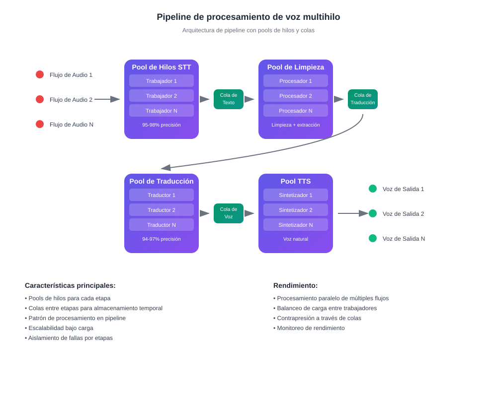

# Cómo funciona la traducción en tiempo real con IA

## Habla y escucha en tu idioma

InterMind es una plataforma de videoconferencias multiusuario con **traducción bidireccional instantánea**. Cada participante puede hablar y escuchar a otros en **su idioma nativo**, creando el efecto de comunicación natural sin barreras idiomáticas.

Conoce más sobre [qué hace diferente a InterMIND](./what-is-intermind) y explora nuestras [características completas de la plataforma](./video-meeting-platform).

## Cómo funciona:

<!-- :::details Show diagram of AI translation process
::: -->

### 1. **Reconocimiento de voz (Voz a texto)**

- Reconocimiento en tiempo real usando modelos transformer
- Procesamiento de ruido y sonidos de fondo
- Soporte para terminología técnica y jerga especializada
- Precisión de reconocimiento: **95-98%** para idiomas principales

### 2. **Postprocesamiento de texto (Limpieza de texto y análisis semántico)**

- **Eliminación de muletillas**: eliminación de "eh", "mm", repeticiones, tartamudeo
- **Corrección de errores de reconocimiento**: corrección basada en contexto
- **Puntuación y estructuración**: colocación automática de signos de puntuación
- **Extracción de significado clave**: identificación de ideas principales y secundarias
- **Segmentación de expresiones**: división en bloques lógicos para traducción precisa
- **Análisis contextual**: vinculación con comentarios previos y tema general

### 3. **Traducción neuronal**

- Traducción dependiente del contexto con preservación del significado
- Comprensión de modismos, metáforas y referencias culturales
- Adaptación del estilo de habla (formal/informal)
- Preservación del matiz emocional de las expresiones

### 4. **Síntesis de voz (Texto a voz)**

- Entonación natural y ritmo del habla
- Preservación de pausas y acentos del original
- Selección de voz masculina/femenina
- Ajuste de velocidad y tono

Todo esto ocurre con **latencia menor a 3 segundos** — igualando la velocidad de intérpretes simultáneos profesionales[^1] [^2].

## Ventajas Prácticas

### Calidad del Procesamiento de Voz:

- **Filtrado de ruido**: eliminación automática de tos, risas, conversaciones de fondo
- **Puntuación inteligente**: reconocimiento de pausas entonacionales y énfasis lógico
- **Corrección de errores**: corrección inmediata de errores tipográficos e imprecisiones de reconocimiento
- **Compresión semántica**: preservación del significado mientras se elimina la redundancia

### Para Empresas:

- **Equipos globales**: eliminación de barreras idiomáticas en equipos internacionales
- **Reuniones con clientes**: comunicación directa con clientes sin servicios de intérprete
- **Capacitación y presentaciones**: entrega simultánea de contenido en múltiples idiomas
- **Ahorro de costos**: reducción de costos de intérpretes hasta un **80%**

### Para Usuarios:

- **Naturalidad**: habla como siempre, piensa en tu idioma nativo
- **Privacidad**: sin terceros (intérpretes)
- **Accesibilidad**: 24/7 sin planificación previa
- **Escalabilidad**: desde 2 hasta más de 1000 participantes

## Mejor que los Humanos — y Mejorando Cada Día

### Stack Tecnológico:

- **Proveedores de LLM**: GPT-4, Claude, Gemini (selección regional)
- **Regionalidad**: cumplimiento con requisitos locales de privacidad (GDPR, CCPA)
- **Aprendizaje continuo**: análisis de más de 10,000 horas de reuniones multilingües mensualmente
- **Especialización**: modelos para industrias específicas (medicina, derecho, finanzas, TI)

### Calidad de Traducción:

- **Precisión**: 94-97% de exactitud para conversaciones de negocios
- **Contexto**: comprensión del contexto durante toda la reunión
- **Terminología**: diccionarios adaptativos para cada industria
- **Retroalimentación**: sistema de calificación de calidad por parte del usuario

### Arquitectura Técnica

Todo el enrutamiento de audio/video se maneja a través de nuestra API Mind propietaria, desarrollada internamente para garantizar:

- **Rendimiento**: procesamiento de más de 1000 transmisiones paralelas
- **Soberanía de datos**: almacenamiento en la región seleccionada
- **Tolerancia a fallos**: 99.9% de tiempo de actividad con conmutación automática por error
- **Escalabilidad**: escalado horizontal bajo carga

### Integración y Compatibilidad:

- **Web**: funciona en cualquier navegador moderno
- **Escritorio**: instalación simple de PWA para Windows/Mac/Linux
- **Aplicaciones móviles**: instalación simple de PWA para iOS/Android
- **API**: integración en plataformas existentes (próximamente)
- **Servicios populares**: Zoom, Teams, Google Meet (vía plugins) (próximamente)

[^1]: La latencia estándar para traducción simultánea humana es de ~2–3 segundos.

[^2]: Basado en el progreso actual en traducción con IA, esperamos que dentro de 2–3 años, los modelos superen consistentemente a los mejores traductores humanos — incluyendo áreas especializadas como derecho, finanzas, salud e ingeniería.

> **¿Quieres saber más?** Lee sobre la [diferencia entre traducción e interpretación](./translation-vs-interpretation-whats-the-difference) o descubre nuestro enfoque hacia la [privacidad de datos](./privacy-architecture).