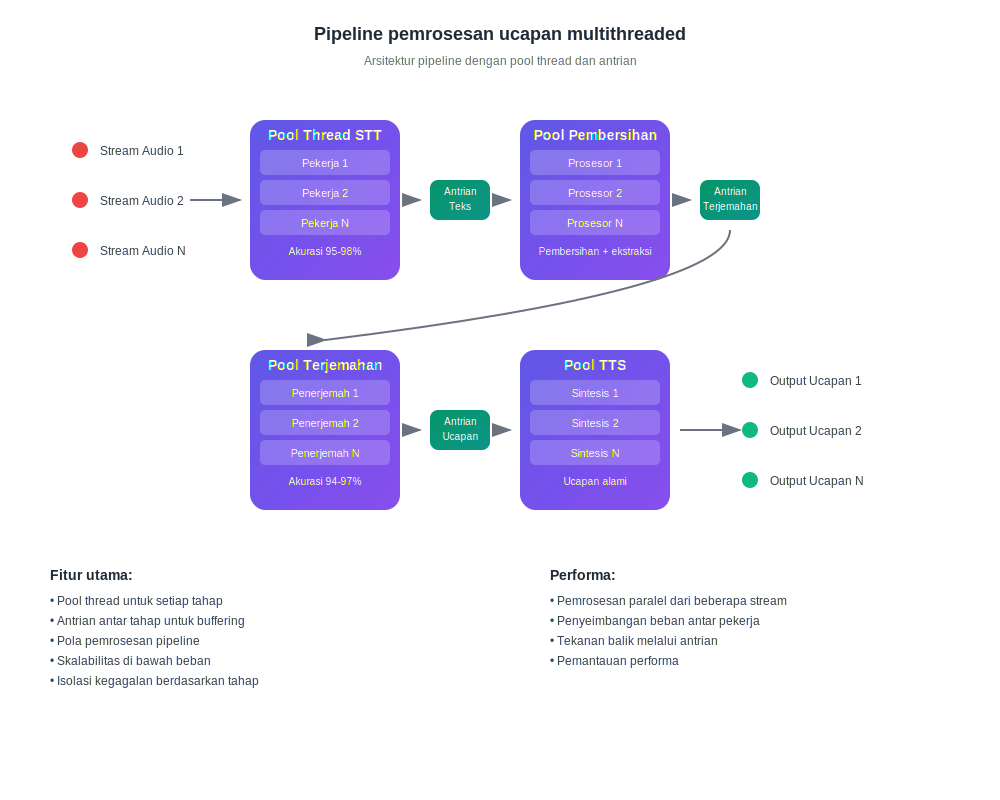

# Cara Kerja Terjemahan Real-Time AI

## Berbicara dan Mendengar dalam Bahasa Anda

InterMind adalah platform konferensi video multi-pengguna dengan **terjemahan dua arah instan**. Setiap peserta dapat berbicara dan mendengar orang lain dalam **bahasa asli mereka**, menciptakan efek komunikasi alami tanpa hambatan bahasa.

## Cara kerjanya:

<!-- :::details Show diagram of AI translation process
::: -->

### 1. **Pengenalan Suara (Speech-to-Text)**

- Pengenalan streaming menggunakan model transformer
- Pemrosesan kebisingan dan suara latar belakang
- Dukungan untuk terminologi teknis dan jargon
- Akurasi pengenalan: **95-98%** untuk bahasa-bahasa utama

### 2. **Pascapemrosesan Teks (Pembersihan Teks & Analisis Semantik)**

- **Penghapusan sampah ucapan**: eliminasi "eh", "um", pengulangan, gagap
- **Koreksi kesalahan pengenalan**: koreksi berbasis konteks
- **Tanda baca dan strukturisasi**: penempatan tanda baca otomatis
- **Ekstraksi makna kunci**: identifikasi pemikiran utama dan sekunder
- **Segmentasi ucapan**: memecah menjadi blok logis untuk terjemahan yang akurat
- **Analisis kontekstual**: menghubungkan dengan komentar sebelumnya dan topik keseluruhan

### 3. **Terjemahan Neural**

- Terjemahan yang bergantung pada konteks dengan pelestarian makna
- Pemahaman idiom, metafora, dan referensi budaya
- Adaptasi gaya bicara (formal/informal)
- Mempertahankan pewarnaan emosional dari ucapan

### 4. **Sintesis Suara (Text-to-Speech)**

- Intonasi alami dan ritme bicara
- Mempertahankan jeda dan aksen dari aslinya
- Pemilihan suara pria/wanita
- Penyesuaian kecepatan dan nada

Semua ini terjadi dengan **latensi di bawah 3 detik** — menyamai kecepatan penerjemah simultan profesional[^1] [^2].

## Keunggulan Praktis

### Kualitas Pemrosesan Suara:

- **Penyaringan kebisingan**: penghapusan otomatis batuk, tawa, percakapan latar belakang
- **Tanda baca cerdas**: pengenalan jeda intonasi dan penekanan logis
- **Koreksi kesalahan**: memperbaiki kesalahan ketik dan ketidakakuratan pengenalan secara langsung
- **Kompresi semantik**: mempertahankan makna sambil menghilangkan redundansi

### Untuk Bisnis:

- **Tim global**: menghilangkan hambatan bahasa dalam tim internasional
- **Rapat klien**: komunikasi langsung dengan klien tanpa layanan penerjemah
- **Pelatihan dan presentasi**: penyampaian konten simultan dalam berbagai bahasa
- **Penghematan biaya**: mengurangi biaya penerjemah hingga **80%**

### Untuk Pengguna:

- **Kealamian**: berbicara seperti biasa, berpikir dalam bahasa ibu Anda
- **Privasi**: tanpa pihak ketiga (penerjemah)
- **Aksesibilitas**: 24/7 tanpa perencanaan sebelumnya
- **Skalabilitas**: dari 2 hingga 1000+ peserta

## Lebih Baik dari Manusia — dan Terus Berkembang Setiap Hari

### Stack Teknologi:

- **Penyedia LLM**: GPT-4, Claude, Gemini (pilihan regional)
- **Regionalitas**: kepatuhan terhadap persyaratan privasi lokal (GDPR, CCPA)
- **Pembelajaran berkelanjutan**: analisis 10.000+ jam rapat multibahasa setiap bulan
- **Spesialisasi**: model untuk industri spesifik (kedokteran, hukum, keuangan, IT)

### Kualitas Terjemahan:

- **Akurasi**: 94-97% ketepatan untuk percakapan bisnis
- **Konteks**: memahami konteks sepanjang seluruh rapat
- **Terminologi**: kamus adaptif untuk setiap industri
- **Umpan balik**: sistem penilaian kualitas pengguna

### Arsitektur Teknis

Semua routing audio/video ditangani melalui Mind API proprietary kami, dikembangkan secara internal untuk memastikan:

- **Performa**: memproses 1000+ stream paralel
- **Kedaulatan data**: penyimpanan di wilayah yang dipilih
- **Toleransi kesalahan**: 99.9% uptime dengan failover otomatis
- **Skalabilitas**: penskalaan horizontal di bawah beban

### Integrasi dan Kompatibilitas:

- **Web**: bekerja di browser modern mana pun
- **Desktop**: instalasi PWA sederhana untuk Windows/Mac/Linux
- **Aplikasi mobile**: instalasi PWA sederhana untuk iOS/Android
- **API**: integrasi ke platform yang ada (segera hadir)
- **Layanan populer**: Zoom, Teams, Google Meet (melalui plugin) (segera hadir)

[^1]: Latensi standar untuk terjemahan simultan manusia adalah ~2–3 detik.

[^2]: Berdasarkan kemajuan saat ini dalam terjemahan AI, kami memperkirakan bahwa dalam 2–3 tahun, model akan secara konsisten mengungguli penerjemah manusia terbaik — termasuk area khusus seperti hukum, keuangan, kesehatan, dan teknik.