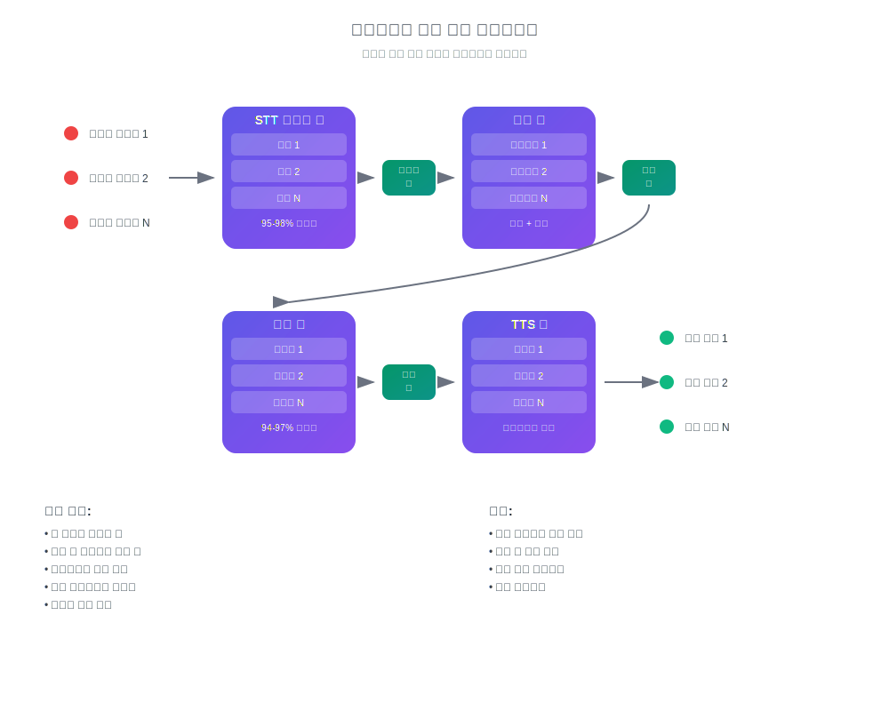

# AI 실시간 번역의 작동 원리

## 당신의 언어로 말하고 듣기

InterMind는 **즉시 양방향 번역** 기능을 갖춘 다중 사용자 화상 회의 플랫폼입니다. 각 참가자는 **자신의 모국어**로 말하고 다른 사람들의 말을 들을 수 있어, 언어 장벽 없이 자연스러운 소통 효과를 만들어냅니다.

## 작동 원리:

<!-- :::details Show diagram of AI translation process
::: -->

### 1. **음성 인식 (Speech-to-Text)**

- 트랜스포머 모델을 사용한 스트리밍 인식
- 노이즈 및 배경음 처리
- 전문 용어 및 전문 언어 지원
- 인식 정확도: 주요 언어에서 **95-98%**

### 2. **텍스트 후처리 (텍스트 정리 및 의미 분석)**

- **음성 잡음 제거**: "어", "음", 반복, 말더듬 제거
- **인식 오류 수정**: 문맥 기반 수정
- **구두점 및 구조화**: 자동 구두점 배치
- **핵심 의미 추출**: 주요 및 부차적 생각 식별
- **발화 분할**: 정확한 번역을 위한 논리적 블록으로 분할
- **문맥 분석**: 이전 발언 및 전체 주제와의 연결

### 3. **신경망 번역**

- 의미 보존을 통한 문맥 의존적 번역
- 관용구, 은유, 문화적 참조의 이해
- 말하기 스타일 적응 (격식/비격식)
- 발화의 감정적 색채 보존

### 4. **음성 합성 (Text-to-Speech)**

- 자연스러운 억양과 말하기 리듬
- 원본의 휴지와 억양 보존
- 남성/여성 음성 선택
- 속도 및 톤 조정

이 모든 과정은 **3초 미만의 지연 시간**으로 이루어집니다 — 전문 동시통역사의 속도와 일치합니다[^1] [^2].

## 실용적 장점

### 음성 처리 품질:

- **노이즈 필터링**: 기침, 웃음소리, 배경 대화의 자동 제거
- **스마트 구두점**: 억양 휴지와 논리적 강조의 인식
- **오류 수정**: 오타와 인식 부정확성의 실시간 수정
- **의미적 압축**: 중복성을 제거하면서 의미 보존

### 비즈니스를 위한:

- **글로벌 팀**: 국제 팀의 언어 장벽 제거
- **고객 미팅**: 통역 서비스 없이 고객과의 직접 소통
- **교육 및 프레젠테이션**: 여러 언어로 동시 콘텐츠 전달
- **비용 절감**: 통역 비용을 최대 **80%**까지 절감

### 사용자를 위한:

- **자연스러움**: 평소처럼 말하고, 모국어로 생각하기
- **프라이버시**: 제3자(통역사) 없음
- **접근성**: 사전 계획 없이 24시간 이용 가능
- **확장성**: 2명부터 1000명 이상의 참가자까지

## 인간보다 뛰어나며 매일 발전하고 있습니다

### 기술 스택:

- **LLM 제공업체**: GPT-4, Claude, Gemini (지역별 선택)
- **지역성**: 현지 개인정보보호 요구사항 준수 (GDPR, CCPA)
- **지속적 학습**: 월 10,000시간 이상의 다국어 회의 분석
- **전문화**: 특정 산업별 모델 (의료, 법률, 금융, IT)

### 번역 품질:

- **정확도**: 비즈니스 대화에서 94-97% 정확성
- **맥락**: 전체 회의 동안의 맥락 이해
- **용어**: 각 산업별 적응형 사전
- **피드백**: 사용자 품질 평가 시스템

> [!info] 기술 아키텍처
>
> 모든 오디오/비디오 라우팅은 다음을 보장하기 위해 자체 개발한 독점 Mind API를 통해 처리됩니다:
>
> - **성능**: 1000개 이상의 병렬 스트림 처리
> - **데이터 주권**: 선택된 지역에 저장
> - **장애 허용**: 자동 장애 조치로 99.9% 가동 시간
> - **확장성**: 부하 상황에서 수평적 확장

### 통합 및 호환성:

- **웹**: 모든 최신 브라우저에서 작동
- **데스크톱**: Windows/Mac/Linux용 간단한 PWA 설치
- **모바일 애플리케이션**: iOS/Android용 간단한 PWA 설치
- **API**: 기존 플랫폼과의 통합 (출시 예정)
- **인기 서비스**: Zoom, Teams, Google Meet (플러그인을 통해) (출시 예정)

[^1]: 인간 동시통역의 표준 지연 시간은 약 2-3초입니다.

[^2]: AI 번역의 현재 진전을 바탕으로, 2-3년 내에 모델이 법률, 금융, 의료, 엔지니어링과 같은 전문 분야를 포함하여 최고의 인간 번역사를 지속적으로 능가할 것으로 예상됩니다.