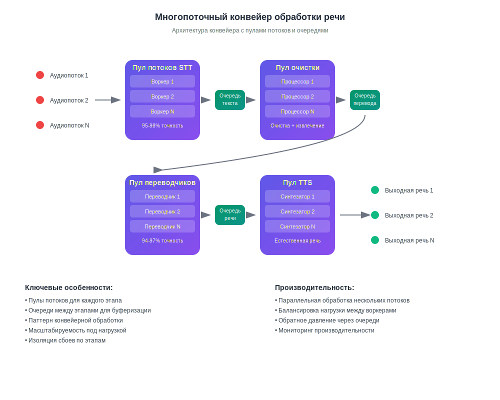

# Как работает ИИ-перевод в реальном времени

## Говорите и слушайте на своем языке

InterMind — это многопользовательская платформа для видеоконференций с **мгновенным двусторонним переводом**. Каждый участник может говорить и слышать других на **своем родном языке**, создавая эффект естественного общения без языковых барьеров.

## Как это работает:

<!-- :::details Show diagram of AI translation process
::: -->

### 1. **Распознавание речи (Speech-to-Text)**

- Потоковое распознавание с использованием трансформерных моделей
- Обработка шумов и фоновых звуков
- Поддержка технической терминологии и жаргона
- Точность распознавания: **95-98%** для основных языков

### 2. **Постобработка текста (очистка текста и семантический анализ)**

- **Удаление речевого мусора**: устранение «э-э», «м-м», повторов, заикания
- **Исправление ошибок распознавания**: коррекция на основе контекста
- **Пунктуация и структурирование**: автоматическая расстановка знаков препинания
- **Извлечение ключевых смыслов**: выявление основных и второстепенных мыслей
- **Сегментация высказываний**: разбиение на логические блоки для точного перевода
- **Контекстный анализ**: связывание с предыдущими репликами и общей темой

### 3. **Нейронный перевод**

- Контекстно-зависимый перевод с сохранением смысла
- Понимание идиом, метафор и культурных отсылок
- Адаптация стиля речи (официальный/неофициальный)
- Сохранение эмоциональной окраски высказываний

### 4. **Синтез речи (Text-to-Speech)**

- Естественная интонация и ритм речи
- Сохранение пауз и акцентов оригинала
- Выбор мужского/женского голоса
- Настройка скорости и тона

Всё это происходит с **задержкой менее 3 секунд** — соответствуя скорости профессиональных синхронных переводчиков[^1] [^2].

## Практические преимущества

### Качество обработки речи:

- **Фильтрация шумов**: автоматическое удаление кашля, смеха, фоновых разговоров
- **Умная пунктуация**: распознавание интонационных пауз и логических ударений
- **Исправление ошибок**: устранение опечаток и неточностей распознавания на лету
- **Семантическое сжатие**: сохранение смысла при удалении избыточности

### Для бизнеса:

- **Глобальные команды**: устранение языковых барьеров в международных командах
- **Встречи с клиентами**: прямое общение с клиентами без услуг переводчика
- **Обучение и презентации**: одновременная подача контента на нескольких языках
- **Экономия средств**: снижение расходов на переводчиков до **80%**

### Для пользователей:

- **Естественность**: говорите как обычно, думайте на родном языке
- **Конфиденциальность**: никаких третьих лиц (переводчиков)
- **Доступность**: 24/7 без предварительного планирования
- **Масштабируемость**: от 2 до 1000+ участников

## Лучше человека — и совершенствуется каждый день

### Технологический стек:

- **LLM-провайдеры**: GPT-4, Claude, Gemini (региональный выбор)
- **Региональность**: соответствие местным требованиям конфиденциальности (GDPR, CCPA)
- **Непрерывное обучение**: анализ 10 000+ часов многоязычных встреч ежемесячно
- **Специализация**: модели для конкретных отраслей (медицина, право, финансы, IT)

### Качество перевода:

- **Точность**: 94-97% корректности для деловых разговоров
- **Контекст**: понимание контекста на протяжении всей встречи
- **Терминология**: адаптивные словари для каждой отрасли
- **Обратная связь**: система оценки качества пользователями

> [!info] Техническая архитектура
>
> Вся маршрутизация аудио/видео обрабатывается через наш собственный Mind API, разработанный внутри компании для обеспечения:
>
> - **Производительность**: обработка 1000+ параллельных потоков
> - **Суверенитет данных**: хранение в выбранном регионе
> - **Отказоустойчивость**: 99,9% времени работы с автоматическим переключением
> - **Масштабируемость**: горизонтальное масштабирование под нагрузкой

### Интеграция и совместимость:

- **Веб**: работает в любом современном браузере
- **Десктоп**: простая установка PWA для Windows/Mac/Linux
- **Мобильные приложения**: простая установка PWA для iOS/Android
- **API**: интеграция в существующие платформы (скоро)
- **Популярные сервисы**: Zoom, Teams, Google Meet (через плагины) (скоро)

[^1]: Стандартная задержка для синхронного перевода человеком составляет ~2–3 секунды.

[^2]: Основываясь на текущем прогрессе в области ИИ-перевода, мы ожидаем, что в течение 2–3 лет модели будут стабильно превосходить лучших переводчиков-людей — включая специализированные области, такие как право, финансы, здравоохранение и инженерия.