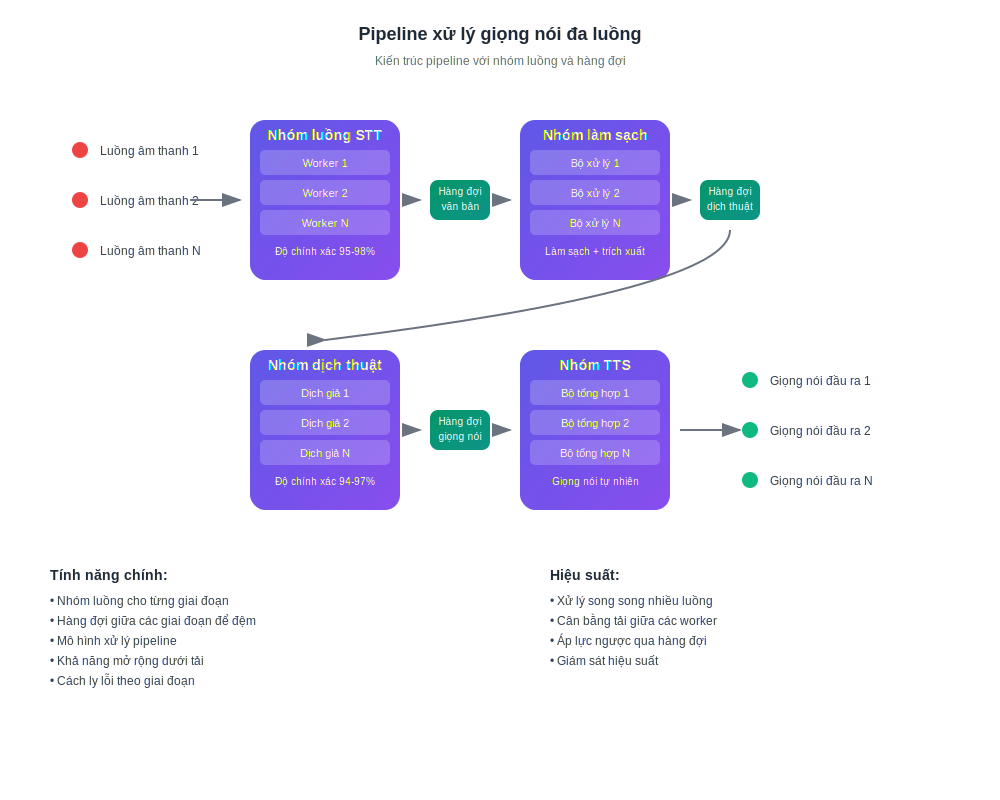

# Cách hoạt động của dịch thuật thời gian thực bằng AI

## Nói và nghe bằng ngôn ngữ của bạn

InterMind là một nền tảng hội nghị truyền hình đa người dùng với **dịch thuật hai chiều tức thì**. Mỗi người tham gia có thể nói và nghe người khác bằng **ngôn ngữ mẹ đẻ của họ**, tạo ra hiệu ứng giao tiếp tự nhiên không có rào cản ngôn ngữ.

## Cách thức hoạt động:

<!-- :::details Show diagram of AI translation process
::: -->

### 1. **Nhận dạng giọng nói (Speech-to-Text)**

- Nhận dạng streaming sử dụng mô hình transformer
- Xử lý tiếng ồn và âm thanh nền
- Hỗ trợ thuật ngữ kỹ thuật và biệt ngữ chuyên ngành
- Độ chính xác nhận dạng: **95-98%** cho các ngôn ngữ chính

### 2. **Xử lý hậu kỳ văn bản (Làm sạch văn bản & Phân tích ngữ nghĩa)**

- **Loại bỏ rác trong lời nói**: loại trừ "ừm", "à", lặp lại, nói lắp
- **Sửa lỗi nhận dạng**: sửa chữa dựa trên ngữ cảnh
- **Dấu câu và cấu trúc**: đặt dấu câu tự động
- **Trích xuất ý nghĩa chính**: xác định ý chính và ý phụ
- **Phân đoạn phát ngôn**: chia thành các khối logic để dịch chính xác
- **Phân tích ngữ cảnh**: liên kết với các nhận xét trước đó và chủ đề tổng thể

### 3. **Dịch thuật neural**

- Dịch phụ thuộc ngữ cảnh với việc bảo toàn ý nghĩa
- Hiểu biết về thành ngữ, ẩn dụ và tham chiếu văn hóa
- Thích ứng phong cách nói (trang trọng/thân mật)
- Bảo toàn sắc thái cảm xúc của phát ngôn

### 4. **Tổng hợp giọng nói (Text-to-Speech)**

- Ngữ điệu và nhịp điệu nói tự nhiên
- Bảo toàn khoảng dừng và giọng điệu của bản gốc
- Lựa chọn giọng nam/nữ
- Điều chỉnh tốc độ và âm sắc

Tất cả điều này xảy ra với **độ trễ dưới 3 giây** — phù hợp với tốc độ của các phiên dịch viên đồng thời chuyên nghiệp[^1] [^2].

## Lợi ích thực tế

### Chất lượng xử lý giọng nói:

- **Lọc tiếng ồn**: tự động loại bỏ tiếng ho, tiếng cười, cuộc trò chuyện nền
- **Dấu câu thông minh**: nhận diện các khoảng dừng ngữ điệu và nhấn mạnh logic
- **Sửa lỗi**: khắc phục lỗi chính tả và sai sót nhận diện ngay lập tức
- **Nén ngữ nghĩa**: bảo toàn ý nghĩa trong khi loại bỏ sự dư thừa

### Cho doanh nghiệp:

- **Đội ngũ toàn cầu**: loại bỏ rào cản ngôn ngữ trong các đội nhóm quốc tế
- **Cuộc họp khách hàng**: giao tiếp trực tiếp với khách hàng mà không cần dịch vụ thông dịch
- **Đào tạo và thuyết trình**: cung cấp nội dung đồng thời bằng nhiều ngôn ngữ
- **Tiết kiệm chi phí**: giảm chi phí thông dịch lên đến **80%**

### Cho người dùng:

- **Tự nhiên**: nói như bình thường, suy nghĩ bằng ngôn ngữ mẹ đẻ
- **Riêng tư**: không có bên thứ ba (thông dịch viên)
- **Khả năng tiếp cận**: 24/7 mà không cần lập kế hoạch trước
- **Khả năng mở rộng**: từ 2 đến hơn 1000 người tham gia

## Tốt hơn con người — và cải thiện mỗi ngày

### Ngăn xếp công nghệ:

- **Nhà cung cấp LLM**: GPT-4, Claude, Gemini (lựa chọn theo khu vực)
- **Tính khu vực**: tuân thủ các yêu cầu bảo mật địa phương (GDPR, CCPA)
- **Học tập liên tục**: phân tích hơn 10.000 giờ cuộc họp đa ngôn ngữ hàng tháng
- **Chuyên môn hóa**: các mô hình cho các ngành cụ thể (y tế, luật, tài chính, IT)

### Chất lượng dịch thuật:

- **Độ chính xác**: 94-97% độ chính xác cho các cuộc trò chuyện kinh doanh
- **Ngữ cảnh**: hiểu ngữ cảnh trong suốt toàn bộ cuộc họp
- **Thuật ngữ**: từ điển thích ứng cho từng ngành
- **Phản hồi**: hệ thống đánh giá chất lượng của người dùng

### Kiến trúc kỹ thuật

Tất cả định tuyến âm thanh/video được xử lý thông qua Mind API độc quyền của chúng tôi, được phát triển nội bộ để đảm bảo:

- **Hiệu suất**: xử lý hơn 1000 luồng song song
- **Chủ quyền dữ liệu**: lưu trữ tại khu vực được chọn
- **Khả năng chịu lỗi**: 99.9% thời gian hoạt động với chuyển đổi dự phòng tự động
- **Khả năng mở rộng**: mở rộng theo chiều ngang dưới tải

### Tích hợp và tương thích:

- **Web**: hoạt động trên mọi trình duyệt hiện đại
- **Desktop**: cài đặt PWA đơn giản cho Windows/Mac/Linux
- **Ứng dụng di động**: cài đặt PWA đơn giản cho iOS/Android
- **API**: tích hợp vào các nền tảng hiện có (sắp ra mắt)
- **Dịch vụ phổ biến**: Zoom, Teams, Google Meet (qua plugin) (sắp ra mắt)

[^1]: Độ trễ tiêu chuẩn cho dịch thuật đồng thời của con người là ~2–3 giây.

[^2]: Dựa trên tiến bộ hiện tại trong dịch thuật AI, chúng tôi kỳ vọng rằng trong vòng 2–3 năm, các mô hình sẽ liên tục vượt trội hơn những dịch giả con người giỏi nhất — bao gồm các lĩnh vực chuyên môn như luật, tài chính, chăm sóc sức khỏe và kỹ thuật.