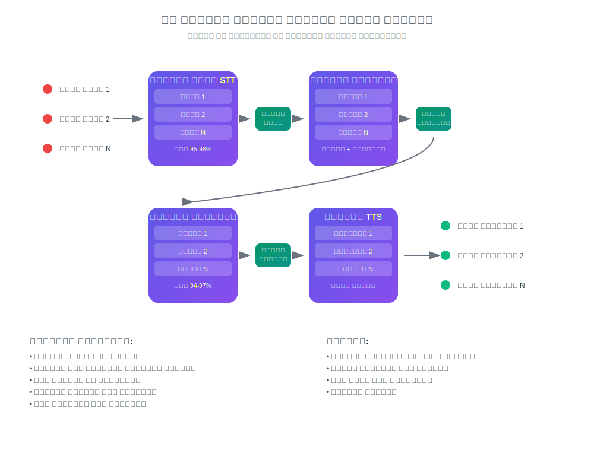

# كيف تعمل الترجمة الفورية بالذكاء الاصطناعي

## تحدث واستمع بلغتك

InterMind هي منصة مؤتمرات فيديو متعددة المستخدمين مع **ترجمة فورية ثنائية الاتجاه**. يمكن لكل مشارك التحدث وسماع الآخرين **بلغته الأم**، مما يخلق تأثير التواصل الطبيعي دون حواجز لغوية.

## كيف يعمل النظام:

<!-- :::details Show diagram of AI translation process
::: -->

### 1. **التعرف على الكلام (تحويل الكلام إلى نص)**

- التعرف المتدفق باستخدام نماذج المحولات
- معالجة الضوضاء والأصوات الخلفية
- دعم المصطلحات التقنية والمهنية
- دقة التعرف: **95-98%** للغات الرئيسية

### 2. **معالجة النص اللاحقة (تنظيف النص والتحليل الدلالي)**

- **إزالة حشو الكلام**: القضاء على "آه"، "أم"، التكرار، التلعثم
- **تصحيح أخطاء التعرف**: التصحيح القائم على السياق
- **علامات الترقيم والهيكلة**: وضع علامات الترقيم التلقائي
- **استخراج المعنى الأساسي**: تحديد الأفكار الرئيسية والثانوية
- **تقسيم الكلام**: التقسيم إلى كتل منطقية للترجمة الدقيقة
- **التحليل السياقي**: الربط مع الملاحظات السابقة والموضوع العام

### 3. **الترجمة العصبية**

- الترجمة المعتمدة على السياق مع الحفاظ على المعنى
- فهم التعابير الاصطلاحية والاستعارات والمراجع الثقافية
- تكييف أسلوب الكلام (رسمي/غير رسمي)
- الحفاظ على التلوين العاطفي للكلام

### 4. **تركيب الكلام (تحويل النص إلى كلام)**

- النبرة الطبيعية وإيقاع الكلام
- الحفاظ على الوقفات ولهجات النص الأصلي
- اختيار الصوت الذكوري/الأنثوي
- تعديل السرعة والنبرة

كل هذا يحدث مع **زمن استجابة أقل من 3 ثوانٍ** — يضاهي سرعة المترجمين الفوريين المحترفين[^1] [^2].

## المزايا العملية

### جودة معالجة الكلام:

- **تصفية الضوضاء**: إزالة تلقائية للسعال والضحك والمحادثات الخلفية
- **علامات الترقيم الذكية**: التعرف على الوقفات النبرية والتأكيد المنطقي
- **تصحيح الأخطاء**: إصلاح الأخطاء الإملائية وأخطاء التعرف فوراً
- **الضغط الدلالي**: الحفاظ على المعنى مع إزالة التكرار

### للأعمال:

- **الفرق العالمية**: إزالة الحواجز اللغوية في الفرق الدولية
- **اجتماعات العملاء**: التواصل المباشر مع العملاء دون خدمات الترجمة الفورية
- **التدريب والعروض التقديمية**: تقديم المحتوى بعدة لغات في الوقت نفسه
- **توفير التكاليف**: تقليل تكاليف المترجمين الفوريين بنسبة تصل إلى **80%**

### للمستخدمين:

- **الطبيعية**: تحدث كالمعتاد، فكر بلغتك الأم
- **الخصوصية**: لا توجد أطراف ثالثة (مترجمون فوريون)
- **إمكانية الوصول**: على مدار الساعة طوال أيام الأسبوع دون تخطيط مسبق
- **قابلية التوسع**: من 2 إلى أكثر من 1000 مشارك

## أفضل من البشر — ويتحسن كل يوم

### المكدس التقني:

- **مقدمو النماذج اللغوية الكبيرة**: GPT-4، Claude، Gemini (اختيار إقليمي)
- **الإقليمية**: الامتثال لمتطلبات الخصوصية المحلية (GDPR، CCPA)
- **التعلم المستمر**: تحليل أكثر من 10,000 ساعة من الاجتماعات متعددة اللغات شهرياً
- **التخصص**: نماذج للصناعات المحددة (الطب، القانون، المالية، تكنولوجيا المعلومات)

### جودة الترجمة:

- **الدقة**: 94-97% صحة للمحادثات التجارية
- **السياق**: فهم السياق خلال الاجتماع بأكمله
- **المصطلحات**: قواميس تكيفية لكل صناعة
- **التقييم**: نظام تقييم جودة المستخدم

### الهيكل التقني

يتم التعامل مع جميع توجيهات الصوت/الفيديو من خلال Mind API الخاص بنا، المطور داخلياً لضمان:

- **الأداء**: معالجة أكثر من 1000 تدفق متوازي
- **سيادة البيانات**: التخزين في المنطقة المختارة
- **تحمل الأخطاء**: 99.9% وقت تشغيل مع التبديل التلقائي
- **قابلية التوسع**: التوسع الأفقي تحت الحمولة

### التكامل والتوافق:

- **الويب**: يعمل في أي متصفح حديث
- **سطح المكتب**: تثبيت PWA بسيط لـ Windows/Mac/Linux
- **تطبيقات الهاتف المحمول**: تثبيت PWA بسيط لـ iOS/Android
- **واجهة برمجة التطبيقات**: التكامل في المنصات الموجودة (قريباً)
- **الخدمات الشائعة**: Zoom، Teams، Google Meet (عبر الإضافات) (قريباً)

[^1]: زمن الاستجابة القياسي للترجمة الفورية البشرية هو ~2–3 ثوانٍ.

[^2]: بناءً على التقدم الحالي في الترجمة بالذكاء الاصطناعي، نتوقع أنه خلال 2–3 سنوات، ستتفوق النماذج باستمرار على أفضل المترجمين البشر — بما في ذلك المجالات المتخصصة مثل القانون والمالية والرعاية الصحية والهندسة.