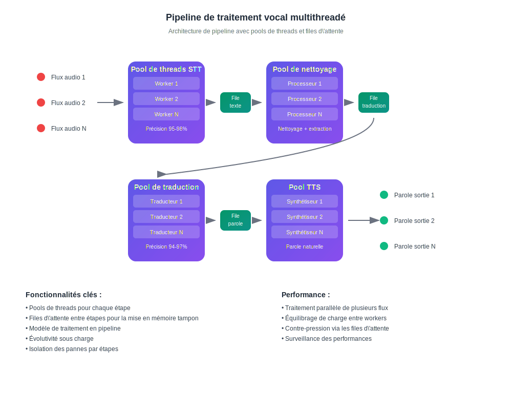

# Comment fonctionne la traduction IA en temps réel

## Parlez et écoutez dans votre langue

InterMind est une plateforme de visioconférence multi-utilisateurs avec **traduction bidirectionnelle instantanée**. Chaque participant peut parler et entendre les autres dans **sa langue maternelle**, créant l'effet d'une communication naturelle sans barrières linguistiques.

## Comment ça fonctionne :

<!-- :::details Show diagram of AI translation process
::: -->

### 1. **Reconnaissance vocale (Speech-to-Text)**

- Reconnaissance en streaming utilisant des modèles transformer
- Traitement du bruit et des sons d\'arrière-plan
- Support de la terminologie technique et du jargon
- Précision de reconnaissance : **95-98%** pour les langues principales

### 2. **Post-traitement du texte (nettoyage du texte et analyse sémantique)**

- **Suppression des parasites vocaux** : élimination des « euh », « hum », répétitions, bégaiements
- **Correction des erreurs de reconnaissance** : correction basée sur le contexte
- **Ponctuation et structuration** : placement automatique de la ponctuation
- **Extraction du sens clé** : identification des pensées principales et secondaires
- **Segmentation des énoncés** : découpage en blocs logiques pour une traduction précise
- **Analyse contextuelle** : liaison avec les remarques précédentes et le sujet global

### 3. **Traduction neuronale**

- Traduction dépendante du contexte avec préservation du sens
- Compréhension des idiomes, métaphores et références culturelles
- Adaptation du style de discours (formel/informel)
- Préservation de la coloration émotionnelle des énoncés

### 4. **Synthèse vocale (Text-to-Speech)**

- Intonation naturelle et rythme de parole
- Préservation des pauses et accents de l\'original
- Sélection de voix masculine/féminine
- Ajustement de la vitesse et du ton

Tout cela se produit avec une **latence inférieure à 3 secondes** — égalant la vitesse des interprètes simultanés professionnels[^1] [^2].

## Avantages pratiques

### Qualité du traitement vocal :

- **Filtrage du bruit** : suppression automatique de la toux, des rires, des conversations en arrière-plan
- **Ponctuation intelligente** : reconnaissance des pauses intonationnelles et de l'accentuation logique
- **Correction d'erreurs** : correction à la volée des fautes de frappe et des inexactitudes de reconnaissance
- **Compression sémantique** : préservation du sens tout en supprimant la redondance

### Pour les entreprises :

- **Équipes mondiales** : élimination des barrières linguistiques dans les équipes internationales
- **Réunions clients** : communication directe avec les clients sans services d'interprétariat
- **Formation et présentations** : diffusion simultanée de contenu en plusieurs langues
- **Économies de coûts** : réduction des coûts d'interprétariat jusqu'à **80 %**

### Pour les utilisateurs :

- **Naturel** : parlez comme d'habitude, pensez dans votre langue maternelle
- **Confidentialité** : aucun tiers (interprètes)
- **Accessibilité** : 24h/24 et 7j/7 sans planification préalable
- **Évolutivité** : de 2 à plus de 1000 participants

## Meilleur que l'humain — et s'améliore chaque jour

### Stack technologique :

- **Fournisseurs LLM** : GPT-4, Claude, Gemini (sélection régionale)
- **Régionalité** : conformité aux exigences locales de confidentialité (RGPD, CCPA)
- **Apprentissage continu** : analyse de plus de 10 000 heures de réunions multilingues par mois
- **Spécialisation** : modèles pour des industries spécifiques (médecine, droit, finance, IT)

### Qualité de traduction :

- **Précision** : 94-97% d'exactitude pour les conversations d'affaires
- **Contexte** : compréhension du contexte tout au long de la réunion
- **Terminologie** : dictionnaires adaptatifs pour chaque industrie
- **Retours** : système d'évaluation de la qualité par les utilisateurs

### Architecture technique

Tout le routage audio/vidéo est géré par notre API propriétaire Mind, développée en interne pour assurer :

- **Performance** : traitement de plus de 1000 flux parallèles
- **Souveraineté des données** : stockage dans la région sélectionnée
- **Tolérance aux pannes** : 99,9% de disponibilité avec basculement automatique
- **Évolutivité** : mise à l'échelle horizontale sous charge

### Intégration et compatibilité :

- **Web** : fonctionne dans tout navigateur moderne
- **Bureau** : installation PWA simple pour Windows/Mac/Linux
- **Applications mobiles** : installation PWA simple pour iOS/Android
- **API** : intégration dans les plateformes existantes (bientôt disponible)
- **Services populaires** : Zoom, Teams, Google Meet (via plugins) (bientôt disponible)

[^1]: La latence standard pour la traduction simultanée humaine est d'environ 2 à 3 secondes.

[^2]: Basé sur les progrès actuels en traduction IA, nous nous attendons à ce que dans 2 à 3 ans, les modèles surpassent systématiquement les meilleurs traducteurs humains — y compris dans des domaines spécialisés tels que le droit, la finance, la santé et l'ingénierie.