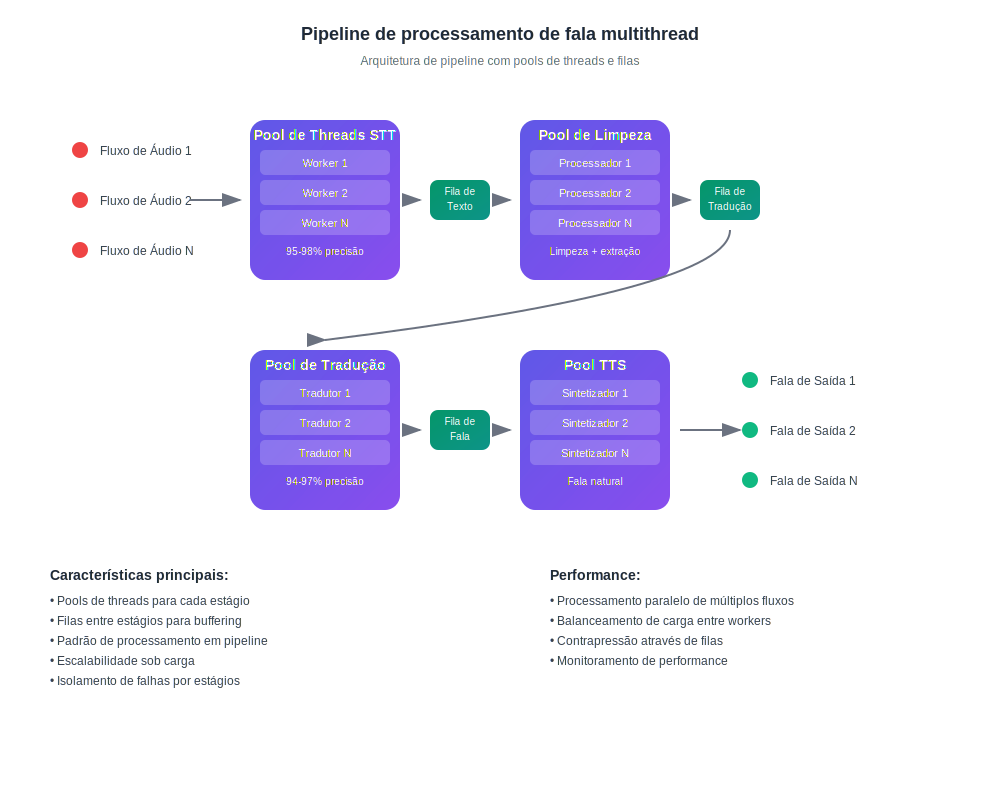

# Como funciona a tradução em tempo real com IA

## Fale e escute em seu idioma

InterMind é uma plataforma de videoconferência multiusuário com **tradução bidirecional instantânea**. Cada participante pode falar e ouvir os outros em **seu idioma nativo**, criando o efeito de comunicação natural sem barreiras linguísticas.

## Como funciona:

<!-- :::details Show diagram of AI translation process
::: -->

### 1. **Reconhecimento de fala (Speech-to-Text)**

- Reconhecimento em streaming usando modelos transformer
- Processamento de ruído e sons de fundo
- Suporte para terminologia técnica e jargões
- Precisão do reconhecimento: **95-98%** para idiomas principais

### 2. **Pós-processamento de texto (limpeza de texto e análise semântica)**

- **Remoção de vícios de linguagem**: eliminação de "ãh", "hum", repetições, gagueira
- **Correção de erros de reconhecimento**: correção baseada em contexto
- **Pontuação e estruturação**: colocação automática de pontuação
- **Extração de significado principal**: identificação de pensamentos principais e secundários
- **Segmentação de enunciados**: divisão em blocos lógicos para tradução precisa
- **Análise contextual**: vinculação com observações anteriores e tópico geral

### 3. **Tradução neural**

- Tradução dependente de contexto com preservação de significado
- Compreensão de expressões idiomáticas, metáforas e referências culturais
- Adaptação do estilo de fala (formal/informal)
- Preservação da coloração emocional dos enunciados

### 4. **Síntese de fala (Text-to-Speech)**

- Entonação natural e ritmo de fala
- Preservação de pausas e acentos do original
- Seleção de voz masculina/feminina
- Ajuste de velocidade e tom

Tudo isso acontece com **latência inferior a 3 segundos** — correspondendo à velocidade de intérpretes simultâneos profissionais[^1] [^2].

## Vantagens Práticas

### Qualidade do Processamento de Fala:

- **Filtragem de ruído**: remoção automática de tosse, risadas, conversas de fundo
- **Pontuação inteligente**: reconhecimento de pausas entonacionais e ênfase lógica
- **Correção de erros**: correção de erros de digitação e imprecisões de reconhecimento em tempo real
- **Compressão semântica**: preservação do significado enquanto remove redundâncias

### Para Empresas:

- **Equipes globais**: eliminação de barreiras linguísticas em equipes internacionais
- **Reuniões com clientes**: comunicação direta com clientes sem serviços de intérprete
- **Treinamentos e apresentações**: entrega simultânea de conteúdo em múltiplos idiomas
- **Economia de custos**: redução de custos com intérpretes em até **80%**

### Para Usuários:

- **Naturalidade**: fale normalmente, pense em seu idioma nativo
- **Privacidade**: sem terceiros (intérpretes)
- **Acessibilidade**: 24/7 sem planejamento antecipado
- **Escalabilidade**: de 2 a mais de 1000 participantes

## Melhor que Humanos — e Melhorando a Cada Dia

### Stack Tecnológico:

- **Provedores de LLM**: GPT-4, Claude, Gemini (seleção regional)
- **Regionalidade**: conformidade com requisitos locais de privacidade (GDPR, CCPA)
- **Aprendizado contínuo**: análise de mais de 10.000 horas de reuniões multilíngues mensalmente
- **Especialização**: modelos para indústrias específicas (medicina, direito, finanças, TI)

### Qualidade da Tradução:

- **Precisão**: 94-97% de correção para conversas empresariais
- **Contexto**: compreensão do contexto durante toda a reunião
- **Terminologia**: dicionários adaptativos para cada indústria
- **Feedback**: sistema de avaliação de qualidade pelo usuário

### Arquitetura Técnica

Todo o roteamento de áudio/vídeo é gerenciado através da nossa API Mind proprietária, desenvolvida internamente para garantir:

- **Performance**: processamento de mais de 1000 streams paralelos
- **Soberania de dados**: armazenamento na região selecionada
- **Tolerância a falhas**: 99,9% de uptime com failover automático
- **Escalabilidade**: escalonamento horizontal sob carga

### Integração e Compatibilidade:

- **Web**: funciona em qualquer navegador moderno
- **Desktop**: instalação simples de PWA para Windows/Mac/Linux
- **Aplicações móveis**: instalação simples de PWA para iOS/Android
- **API**: integração em plataformas existentes (em breve)
- **Serviços populares**: Zoom, Teams, Google Meet (via plugins) (em breve)

[^1]: Latência padrão para tradução simultânea humana é de ~2–3 segundos.

[^2]: Com base no progresso atual em tradução por IA, esperamos que dentro de 2–3 anos, os modelos superem consistentemente os melhores tradutores humanos — incluindo áreas especializadas como direito, finanças, saúde e engenharia.