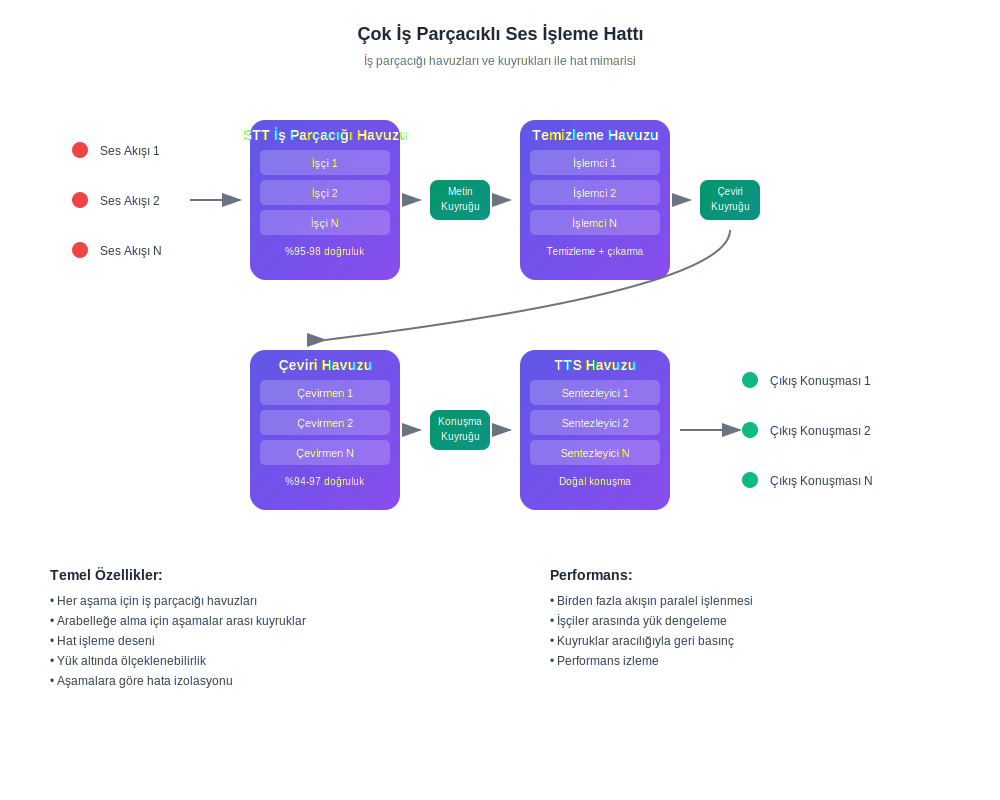

# Yapay zeka gerçek zamanlı çevirisi nasıl çalışır

## Kendi Dilinizde Konuşun ve Dinleyin

InterMind, **anlık çift yönlü çeviri** özelliğine sahip çok kullanıcılı bir video konferans platformudur. Her katılımcı **kendi ana dilinde** konuşabilir ve diğerlerini duyabilir, böylece dil engellerinin olmadığı doğal iletişim etkisi yaratır.

## Nasıl çalışır:

<!-- :::details Show diagram of AI translation process
::: -->

### 1. **Konuşma tanıma (konuşmadan metne)**

- Transformer modelleri kullanarak akış tanıma
- Gürültü ve arka plan seslerini işleme
- Teknik terminoloji ve jargon desteği
- Tanıma doğruluğu: ana diller için **%95-98**

### 2. **Metin son işleme (metin temizleme ve anlamsal analiz)**

- **Konuşma artıklarını kaldırma**: "ee", "şey", tekrarlar, kekelemeler
- **Tanıma hatası düzeltme**: bağlam tabanlı düzeltme
- **Noktalama ve yapılandırma**: otomatik noktalama yerleştirme
- **Ana anlam çıkarma**: birincil ve ikincil düşüncelerin belirlenmesi
- **Söylem segmentasyonu**: doğru çeviri için mantıksal bloklara ayırma
- **Bağlamsal analiz**: önceki açıklamalar ve genel konu ile bağlantı kurma

### 3. **Sinir ağı çevirisi**

- Anlam korunarak bağlama bağlı çeviri
- Deyimler, metaforlar ve kültürel referansları anlama
- Konuşma tarzı uyarlaması (resmi/gayri resmi)
- Söylemlerin duygusal rengini koruma

### 4. **Konuşma sentezi (metinden konuşmaya)**

- Doğal tonlama ve konuşma ritmi
- Orijinalin duraklamalarını ve vurgularını koruma
- Erkek/kadın ses seçimi
- Hız ve ton ayarlaması

Tüm bunlar **3 saniyenin altında gecikme** ile gerçekleşir — profesyonel simultane tercümanların hızına eşdeğer[^1] [^2].

## Pratik Avantajlar

### Konuşma İşleme Kalitesi:

- **Gürültü filtreleme**: öksürük, kahkaha, arka plan konuşmalarının otomatik olarak kaldırılması
- **Akıllı noktalama**: tonlama durakları ve mantıksal vurguların tanınması
- **Hata düzeltme**: yazım hatalarının ve tanıma yanlışlıklarının anında düzeltilmesi
- **Anlamsal sıkıştırma**: gereksizlikleri kaldırırken anlamın korunması

### İş Dünyası İçin:

- **Küresel ekipler**: uluslararası ekiplerde dil engellerinin ortadan kaldırılması
- **Müşteri toplantıları**: tercüman hizmetleri olmadan müşterilerle doğrudan iletişim
- **Eğitim ve sunumlar**: içeriğin aynı anda birden fazla dilde sunulması
- **Maliyet tasarrufu**: tercüman maliyetlerinde **%80**'e varan azalma

### Kullanıcılar İçin:

- **Doğallık**: her zamanki gibi konuşun, ana dilinizde düşünün
- **Gizlilik**: üçüncü taraf yok (tercümanlar)
- **Erişilebilirlik**: önceden planlama yapmadan 7/24
- **Ölçeklenebilirlik**: 2'den 1000+ katılımcıya kadar

## İnsandan Daha İyi — ve Her Gün Gelişiyor

### Teknoloji Yığını:

- **LLM sağlayıcıları**: GPT-4, Claude, Gemini (bölgesel seçim)
- **Bölgesellik**: yerel gizlilik gereksinimlerine uyum (GDPR, CCPA)
- **Sürekli öğrenme**: aylık 10.000+ saatlik çok dilli toplantı analizi
- **Uzmanlaşma**: belirli endüstriler için modeller (tıp, hukuk, finans, BT)

### Çeviri Kalitesi:

- **Doğruluk**: iş konuşmaları için %94-97 doğruluk
- **Bağlam**: tüm toplantı boyunca bağlamı anlama
- **Terminoloji**: her endüstri için uyarlanabilir sözlükler
- **Geri bildirim**: kullanıcı kalite değerlendirme sistemi

### Teknik Mimari

Tüm ses/video yönlendirmesi, şunları sağlamak için şirket içinde geliştirilen özel Mind API'miz aracılığıyla gerçekleştirilir:

- **Performans**: 1000+ paralel akış işleme
- **Veri egemenliği**: seçilen bölgede depolama
- **Hata toleransı**: otomatik yük devretme ile %99.9 çalışma süresi
- **Ölçeklenebilirlik**: yük altında yatay ölçeklendirme

### Entegrasyon ve Uyumluluk:

- **Web**: herhangi bir modern tarayıcıda çalışır
- **Masaüstü**: Windows/Mac/Linux için basit PWA kurulumu
- **Mobil uygulamalar**: iOS/Android için basit PWA kurulumu
- **API**: mevcut platformlara entegrasyon (yakında)
- **Popüler hizmetler**: Zoom, Teams, Google Meet (eklentiler aracılığıyla) (yakında)

[^1]: İnsan eşzamanlı çeviri için standart gecikme ~2–3 saniyedir.

[^2]: AI çevirisindeki mevcut ilerlemeye dayanarak, 2–3 yıl içinde modellerin en iyi insan çevirmenleri tutarlı bir şekilde geride bırakacağını bekliyoruz — hukuk, finans, sağlık ve mühendislik gibi uzman alanlar dahil.