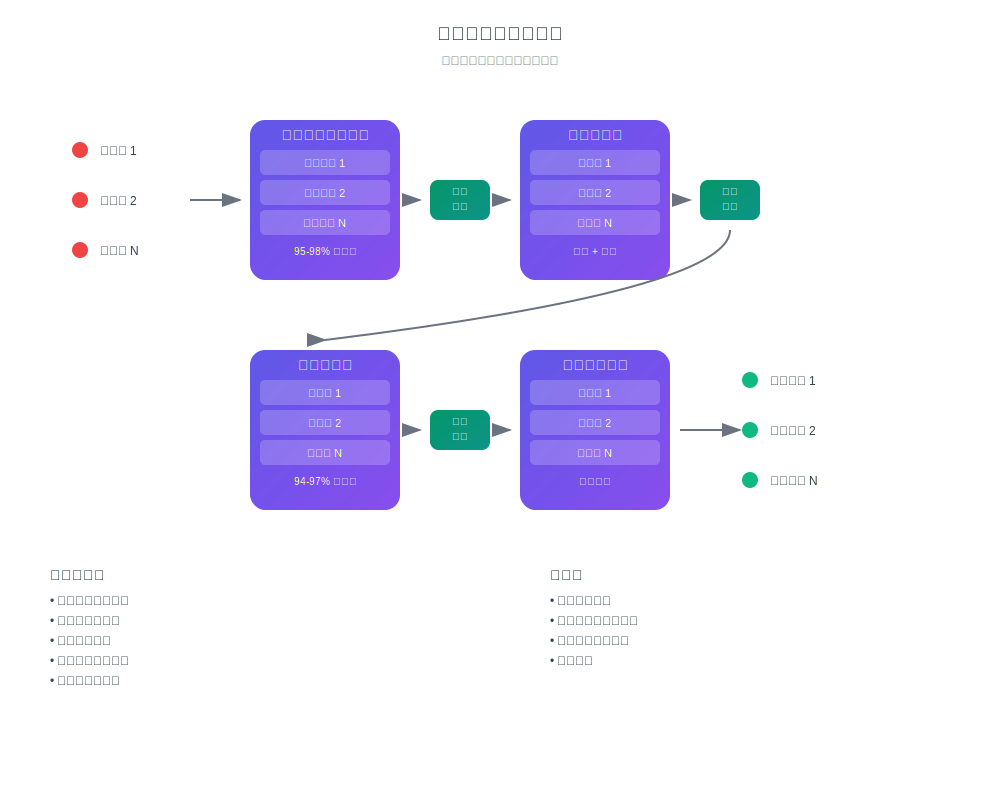

# AI实时翻译的工作原理

## 用您的语言交流和聆听

InterMind 是一个多用户视频会议平台，具有**即时双向翻译**功能。每位参与者都可以用**自己的母语**交流和聆听他人发言，创造出无语言障碍的自然沟通体验。

## 工作原理：

<!-- :::details Show diagram of AI translation process
::: -->

### 1. **语音识别（语音转文本）**

- 使用transformer模型进行流式识别
- 处理噪音和背景声音
- 支持专业术语和行话
- 识别准确率：主要语言达到 **95-98%**

### 2. **文本后处理（文本清理和语义分析）**

- **语音垃圾清除**：消除"呃"、"嗯"、重复、结巴等
- **识别错误纠正**：基于上下文的纠正
- **标点和结构化**：自动标点符号放置
- **关键意义提取**：识别主要和次要思想
- **话语分割**：分解为逻辑块以实现准确翻译
- **上下文分析**：与先前言论和整体话题的关联

### 3. **神经翻译**

- 依赖上下文的翻译，保持意义
- 理解习语、隐喻和文化引用
- 语言风格适应（正式/非正式）
- 保持话语的情感色彩

### 4. **语音合成（文本转语音）**

- 自然的语调和语音节奏
- 保持原文的停顿和重音
- 男声/女声选择
- 速度和音调调节

所有这些都在 **3秒以内的延迟** 下完成——与专业同声传译员的速度相匹配[^1] [^2]。

## 实用优势

### 语音处理质量：

- **噪音过滤**：自动去除咳嗽、笑声、背景对话
- **智能标点**：识别语调停顿和逻辑重点
- **错误纠正**：实时修正拼写错误和识别不准确
- **语义压缩**：在去除冗余的同时保持意义

### 商业应用：

- **全球团队**：消除国际团队中的语言障碍
- **客户会议**：与客户直接沟通，无需口译服务
- **培训和演示**：同时以多种语言提供内容
- **成本节约**：口译费用最多可减少 **80%**

### 用户体验：

- **自然性**：正常说话，用母语思考
- **隐私性**：无第三方（口译员）参与
- **便利性**：全天候24/7服务，无需提前规划
- **可扩展性**：支持2到1000+参与者

## 超越人类——每天都在进步

### 技术栈：

- **LLM提供商**：GPT-4、Claude、Gemini（区域选择）
- **区域性**：符合当地隐私要求（GDPR、CCPA）
- **持续学习**：每月分析10,000+小时多语言会议
- **专业化**：针对特定行业的模型（医学、法律、金融、IT）

### 翻译质量：

- **准确性**：商务对话94-97%的正确率
- **上下文**：理解整个会议的上下文
- **术语**：每个行业的自适应词典
- **反馈**：用户质量评级系统

### 技术架构

所有音频/视频路由都通过我们专有的Mind API处理，该API为内部开发，确保：

- **性能**：处理1000+并行流
- **数据主权**：在选定区域存储
- **容错性**：99.9%正常运行时间，具有自动故障转移
- **可扩展性**：负载下的水平扩展

### 集成和兼容性：

- **网页**：在任何现代浏览器中工作
- **桌面**：Windows/Mac/Linux简单PWA安装
- **移动应用**：iOS/Android简单PWA安装
- **API**：集成到现有平台（即将推出）
- **热门服务**：Zoom、Teams、Google Meet（通过插件）（即将推出）

[^1]: 人类同声传译的标准延迟约为2-3秒。

[^2]: 基于AI翻译的当前进展，我们预计在2-3年内，模型将持续超越最优秀的人类翻译员——包括法律、金融、医疗和工程等专业领域。